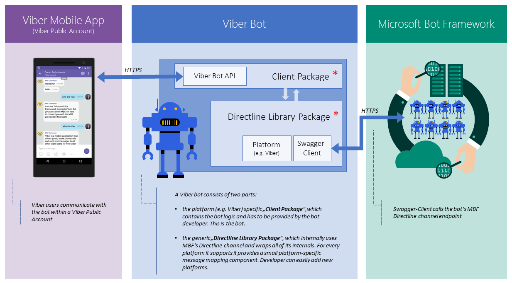
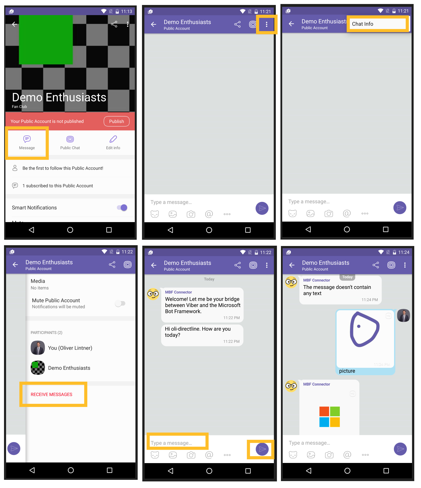

# Connect the Viber bot platform with the Microsoft Bot Framework

The [Microsoft Bot Framework](https://dev.botframework.com/) ([https://dev.botframework.com/](https://dev.botframework.com/ "https://dev.botframework.com/")), shortened MBF, provides a couple of channels which enables bot developers to easily connect their bots to a limited number of platforms (e.g. Skype, Facebook Messenger, Telegram, etc). To due the openness of MBF, it is also possible to integrate other applications ro bot platforms like Viber's Public Accounts. 

I recently worked with a partner on a project which required the integration of MBF bots with the popular [Viber](http://www.viber.com) ([http://www.viber.com](http://www.viber.com)) chat platform. Luckily, Viber already has its own bot platform that is a part of a feature called '[Public Accounts](https://www.viber.com/en/public-accounts)' ([https://www.viber.com/en/public-accounts](https://www.viber.com/en/public-accounts "https://www.viber.com/en/public-accounts")). The goal is to connect existing MBF bots with Viber's platform with as little as possible code modifications on the MBF bot's side. My part of the project was to demonstrate how such an integration could look like and to provide a first working version. When I had first working prototype ready, it turned out that some code parts can be reused for implementing MBF connectors for  other applications or platforms. Therefore, I extracted that part of the code and generialized it by removing Viber-specific parameters and API calls and moved it into a separate library. 

This repository demonstrates one way of implementating a Viber - MBF connector using Node.js

### Out-of-scope
Topics like scalability or high availability are out-of-scope and won't be covered in here. 

## Prerequisites

- Install Node.js ([https://nodejs.org/en/download/](https://nodejs.org/en/download/ "https://nodejs.org/en/download/"))
- Install the Viber app. Ensure that the version supports 'Public Accounts' (currently, this functionality is only available on [Android](https://play.google.com/store/apps/details?id=com.viber.voip&hl=de) or [iOS](https://itunes.apple.com/us/app/viber/id382617920?mt=8)). 
- An Microsoft Bot Framework account (basically, this is a Live/Hotmail/Outlook.com account). Sign up at the Microsoft Bot Framework portal [https://dev.botframework.com/](https://dev.botframework.com/ "https://dev.botframework.com/")
- *(Optional). A Microsoft Azure account if you want use the Azure Bot Service and want to host your bot on Azure. You can start your free trial on this official Azure web page ([https://azure.microsoft.com/en-us/](https://azure.microsoft.com/en-us/ "https://azure.microsoft.com/en-us/"))* 
 

## Solution Overview

The visualization below illustrates the solution's major building blocks and how the Viber mobile app will be able to communicate with a bot based on the Microsoft Bot Framework. 

The implementation provided in this repo consists of the following packages: '*Generic Directline library package*' and '*Client Package for Viber*'.

### Generic Directline Libary package
This generic library wraps the currently available MBF Directline (v3) API, which enables the MBF communication. The major parts of this Directline are completely platform agnostic, which means there are no hard dependencies to any other bot platform (like the Viber bot platform).  This allows to use this ibrary in any other bot platform, as well. 

There is only one small component called '*Platform*' maps MBF activities to messages of the specific bot platform. Needless to say, that the different bot platforms use a different message structure (sometimes including features that are unique on a certain platform). 

The Directline Library package contains the following modules:

- **Core**. This module contains the core Diretline abstraction. 
- **Events**. Enumeration of events the core module will emit.
- **Activities**. Actual MBF activities. Currently, the following activity types are supported: '*ConversationUpdate*' and '*Message*'
- **Platforms**. Platform-specific mapping code.

This table shows which native messages are supported on which platform:

| Message  | Viber |
|----------|:-----:|
| Text     |  yes  |
| Picture  |  yes  |
| Url      |  yes  |
| Contact  |   no  |
| Video    |  yes  |
| Location |   no  |
| Sticker  |   no  |
| File     |  yes  |

### Client package for Viber
A Client package represents an MBF connector for a specific application or platform. Usually, different applications or platforms have their own message types and structure as well as message exchange protocol.

This solution includes a Client package for Viber's chat platform (Public Account feature). It uses Viber's official NPM package. You can find more information at [Viber's Developers Hub](https://developers.viber.com/) ([https://developers.viber.com/](https://developers.viber.com/ "https://developers.viber.com/"))

## Set it up

### Create a Viber Public Account
> **Note**: The Public Account does not have to be published. 

Its super easy to create you own public Account. Just apply for a Public Account at [https://www.viber.com/en/public-accounts](https://www.viber.com/en/public-accounts "https://www.viber.com/en/public-accounts"). It shouldn't take too long until your application gets approved (in fact, if everything goes well, it's supposed to be matter of minutes).

Once it's approved start creating your Public Account by following the procedure described on Viber's Developer Hub ([https://developers.viber.com/public-accounts/index.html#public-accounts](https://developers.viber.com/public-accounts/index.html#public-accounts "https://developers.viber.com/public-accounts/index.html#public-accounts")). 

> **Important**: Ensure that you copy your authentication token. This is needed in your bot implementation and allows your Viber bot to integrate with the Public Account platform.

### Enable Direct Line support for your MBF Bot

> **Note**: The current solution does only support the Direct Line v3. 

As the MBF doesn't come with a out-of-box Viber channel, we have to use something else here. The MBF's Directline channel acts as a multi-purpose communication channel that enables the integration of MBF bots into any application. 

This following guide will walk you through how to enable Directline for your MBF bot and get the required key that is required for the connector (screenshots below from left to right)

1. As this channel hast to be enabled and configured per bot, go to the Microsoft Bot Framework portal, open your 'My Bots' collection (*screenshot #1*)
2. Scroll down to the 'Channel' section and add the 'Direct Line' channel. (*screenhot #2*)
3. Create a new Direct Line site, called 'Viber'. Each site comes with a pair of secrets which are required when connecting to this channel. Copy one the secrets (doesn't matter which one you take) as we'll need it in the Viber-MBF connector. When done finish the Direct Line configuration by clicking on the button at the bottom. (*screenshot #3*)
4. Once Direct Line is enabled for a bot the channel will have the 'Enabled' property set to 'Yes' (*screenshot #4*)
  
  

  

### Linking the NPM packages

Currently the MBF Directline library package is not published to a NPM repository. However, by using `npm link` ([https://docs.npmjs.com/cli/link](https://docs.npmjs.com/cli/link "https://docs.npmjs.com/cli/link")) the library package can easily be linked to the client (e.g. Viber) package.

    cd ./lib					# navigate to the library packages directory
	npm link					# create a global link to this package

	cd ../clients/viber			# navigate to the client package (references the lib package)
	npm link mbf-directline		# link install the MBF Directline package
	

## Run it

> **Note**: Viber provides some good documentation on how to get started with the bot development on the Viber platform. Just navigate to [Viber's Development Hub](https://developers.viber.com/) ([https://developers.viber.com/](https://developers.viber.com/ "https://developers.viber.com/")) and select your preferred technology ([Node.js](https://developers.viber.com/api/nodejs-bot-api/index.html), [Python](https://developers.viber.com/api/python-bot-api/index.html), [Java](https://developers.viber.com/api/java-bot-api/index.html) or [REST](https://developers.viber.com/api/rest-bot-api/index.html)). They have a demo bot on Github ([https://github.com/Viber/sample-bot-isitup](https://github.com/Viber/sample-bot-isitup "https://github.com/Viber/sample-bot-isitup")). The Viber piece in this solutions is based on their implementation.

In order to run the solution the following parameter have to be provided:

    VIBER_PUBLIC_ACCOUNT_ACCESS_TOKEN_KEY			# The access token key created for your Viber Public Account
	MICROSOFT_BOT_DIRECT_LINE_SECRET				# The secret key of the your MBF bot's Directline channel
	WEBSERVER_URL									# The URL where your Viber bot is hosted (this has to be externally accessible!)
	WEBSERVER_PORT									# The web server's port. Web server where your Viber bot is hosted

Although these parameteres can be set in code, it is recommended to set them via environment variables.

> **Note**: Of course, you can also run this implementation locally and use tools like [ngrok](https://ngrok.com/) ([https://ngrok.com/](https://ngrok.com/ "https://ngrok.com/")) to expose the your local server to the internet (this is especially helpful during development and for debugging). E.g. for ngrok use the following command (commandline):
> 
> `ngrok http --host-header=rewrite 8080`
> 
> This opens up a tunnel and provide access to your localhost (port: 8080). Ensure you'll assign the generated ngrok URL to the *WEBSERVER_URL* parameter.

Once everything is configured and the Viber client package is accessible via the internet you can open up your Viber mobile app, navigate to your Public Account and start a chat. Now, these chat messages will be routed to your Viber bot implementation.

Here is a step by step guide on how to chat with Viber Public Account chat bot (screenshots below from left to right).

1. In the Viber mobile app, navigate to your Public Account (*screenshot #1*)
2. Ensure that that receiving messages is enabled. This ensures that a conversation is started with the MBF bot. (*screenshot #2 - #4*)
3. Once a conversation with the MBF bot is created you'll see the bot's greeting message; if implemented by the MBF bot developer. (*screenshot #5*)
4. You can chat with the MBF bot. (*screenshot #6*)

> **Note**: If something goes wrong and you want to reset the MBF connection you can do so by stop receiving chat messages and re-enable it again (as shown in *screenshot #4*). 

## Extend it

The current structure makes it easy to integrate the Directline package with other chat platforms. If want to do so you implement the following parts:

- **Platform-specific mapping code**. A mapping code has to be available. These should be part of the library package and should be placed under `source\lib\platform\`. 
- **Client implementation**. This part translates integrates the Directline library package into the specific bot platform. It has to map the bot platforms events (message protocol) to the Directline ones. As the Directline library package is supposed to be platform indepdendent this code should be placed in a separate package. In this repo the different client implementations are located here: `source\clients\[NAME OF BOT PLATFORM]\`

Currently the following chat platforms are supported: Viber

## Resources
- Viber Public Accounts ([https://www.viber.com/en/public-accounts](https://www.viber.com/en/public-accounts "https://www.viber.com/en/public-accounts"))
- Viber Developers Hub ([https://developers.viber.com/](https://developers.viber.com/ "https://developers.viber.com/"))
- Microsoft Bot Framework ([https://dev.botframework.com/](https://dev.botframework.com/ "https://dev.botframework.com/"))
- Azure Bot Service ([https://azure.microsoft.com/en-us/services/bot-service/](https://azure.microsoft.com/en-us/services/bot-service/ "https://azure.microsoft.com/en-us/services/bot-service/"))
- ngrok - Secure tunnels to localhost ([https://ngrok.com/](https://ngrok.com/ "https://ngrok.com/"))
